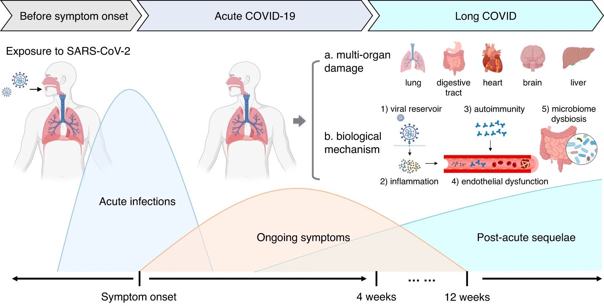
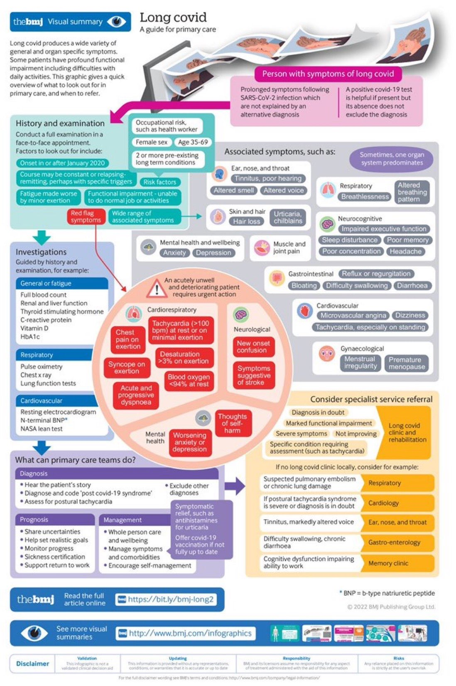

# Long COVID
## Summary
"Long COVID" is not COVID itself, but rather the constellation of health effects experienced from having had COVID. There is no testing for Long COVID. It is far more difficult to identify; much is still being done to understand these potential outcomes. Some people will develop chronic conditions as a result, and some will only experience temporary setbacks to varying extremes.  
  
The most important things to remember are that with each reinfection, your chances of experiencing 
## Infographics
#### Long COVID timeline

#### Long COVID care guide

